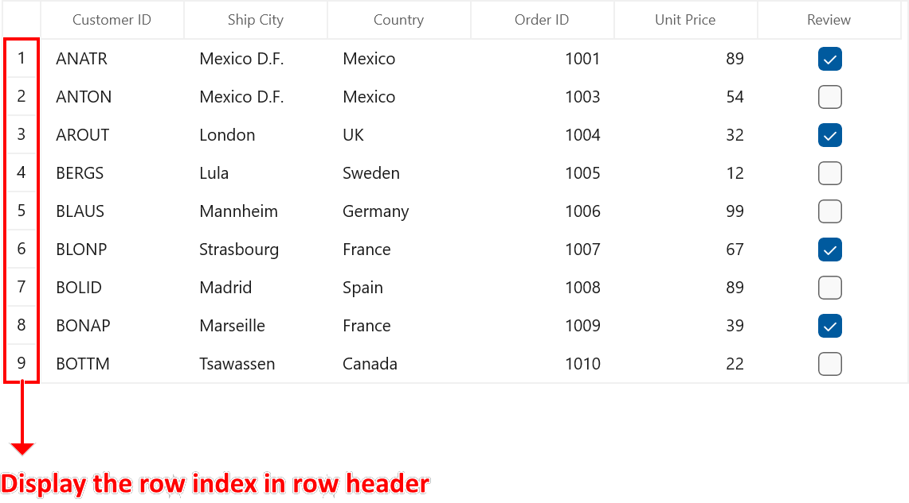
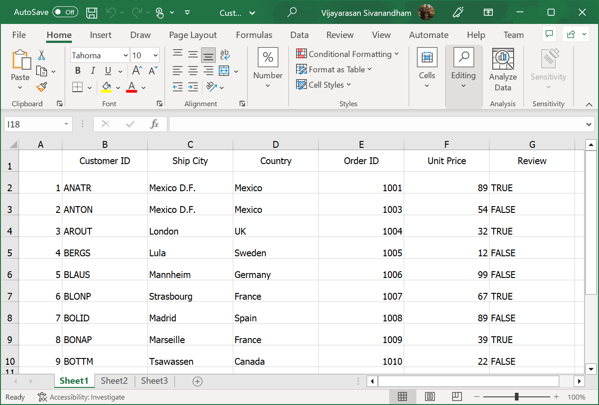

# How to export the WinUI DataGrid (SfDataGrid) to excel with RowHeader?

[WinUI DataGrid](https://www.syncfusion.com/winui-controls/datagrid) (SfDataGrid) does not provide the support to export the row header. You can export the row header column by using **Worksheet.InsertColumn** method to insert a column manually in ExcelSheet and make customization in the inserted column.  

 ```C#
private void btnExportToExcelClicked(object sender, RoutedEventArgs e)
{            
     var options = new DataGridExcelExportOptions(); 
     var excelEngine = dataGrid.ExportToExcel(dataGrid.View, options);
     var workBook = excelEngine.Excel.Workbooks[0];
     IWorksheet sheet = workBook.Worksheets[0];

     // Inserting a new column to the left of the first column
     sheet.InsertColumn(1, 1, ExcelInsertOptions.FormatDefault);
     
     // Get the number of rows count
     var rowcount = this.dataGrid.RowGenerator.Items.Count;

     for (int i = 1; i < rowcount; i++)
     {
         // Inserting the row index in the first row
         sheet.Range["A" + (i + 1).ToString()].Number = i;
     }

     MemoryStream stream = new MemoryStream();
     workBook.SaveAs(stream);
     Save(stream, "Sample");

     async void Save(MemoryStream stream, string filename)
     {
         StorageFile stFile;

         if (!(Windows.Foundation.Metadata.ApiInformation.IsTypePresent("Windows.Phone.UI.Input.HardwareButtons")))
         {
             FileSavePicker savePicker = new FileSavePicker();
             savePicker.DefaultFileExtension = ".xlsx";
             savePicker.SuggestedFileName = filename;
             savePicker.FileTypeChoices.Add("Excel Documents", new List<string>() { ".xlsx" });
             var hwnd = System.Diagnostics.Process.GetCurrentProcess().MainWindowHandle;
             WinRT.Interop.InitializeWithWindow.Initialize(savePicker, hwnd);
             stFile = await savePicker.PickSaveFileAsync();
         }
         else
         {
             StorageFolder local = ApplicationData.Current.LocalFolder;
             stFile = await local.CreateFileAsync(filename, CreationCollisionOption.ReplaceExisting);
         }
         if (stFile != null)
         {
             using (IRandomAccessStream zipStream = await stFile.OpenAsync(FileAccessMode.ReadWrite))
             {
                 //Write the compressed data from the memory to the file
                 using (Stream outstream = zipStream.AsStreamForWrite())
                 {
                     byte[] buffer = stream.ToArray();
                     outstream.Write(buffer, 0, buffer.Length);
                     outstream.Flush();
                 }
             }
             //Launch the saved Excel file.
             await Windows.System.Launcher.LaunchFileAsync(stFile);
         }
     }
}
 ```
The following screenshot illustrates the RowHeader displayed in [WinUI DataGrid](https://www.syncfusion.com/winui-controls/datagrid) (SfDataGrid),
 
 

The following screenshot illustrates exported Excel Sheet with RowHeader,
 
 
 
Take a moment to peruse the [WinUI DataGrid - Export To Excel](https://help.syncfusion.com/winui/datagrid/export-to-excel) documentation, where you can find about export to Excel with code examples.
 
